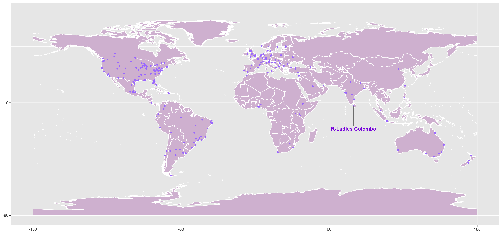

### Creating R-Ladies World Map

```r
library(ggplot2)
library(maptools)
library(tibble)
library(tidyverse)
library(ggrepel)
data(wrld_simpl)

p <- ggplot() +
  geom_polygon(
    data = wrld_simpl,
    aes(x = long, y = lat, group = group), fill = "mediumpurple1", colour = "white"
  ) +
  coord_cartesian(xlim = c(-180, 180), ylim = c(-90, 90)) +
  scale_x_continuous(breaks = seq(-180, 180, 120)) +
  scale_y_continuous(breaks = seq(-90, 90, 100))

# R-Ladies current chapters: https://github.com/rladies/starter-kit/blob/master/Current-Chapters.csv
df <- read.csv(here::here("R-Ladies_map", "Current-Chapters.csv"), header = TRUE) %>% as_tibble()
df$City <- as.character(df$City)
df$Country <- as.character(df$Country)
## location details of the cities : https://simplemaps.com/data/world-cities
location_df <- read.csv(here::here("R-Ladies_map", "worldcities.csv"), header = TRUE) %>% as_tibble()
location_df$city <- as.character(location_df$city)
location_df$country <- as.character(location_df$country)

d <- left_join(df, location_df, by = c("Country" = "country", "City" = "city")) %>%
  select(c("Country", "City", "Status", "lat", "lng"))

dsl <- d %>% filter(Country == "Sri Lanka")


p <- p +
  geom_point(
    data = d, aes(x = lng, y = lat), color = "purple4", size
    = 1
  ) +
  geom_point(
    data = dsl, aes(x = lng, y = lat), color = "darkorchid4", size
    = 1
  ) +
  theme(axis.title = element_blank()) +
  geom_text_repel(
    data = dsl, aes(label = "R-Ladies Colombo", x = lng, y = lat),
    box.padding = 0.35,
    point.padding = 0.5,
    segment.color = "grey50",
    nudge_y = -20,
    color = "mediumorchid"
  )

ggsave(here::here("R-Ladies_map", "R-ladiesmap.png"), width = 15, height = 7)

```


